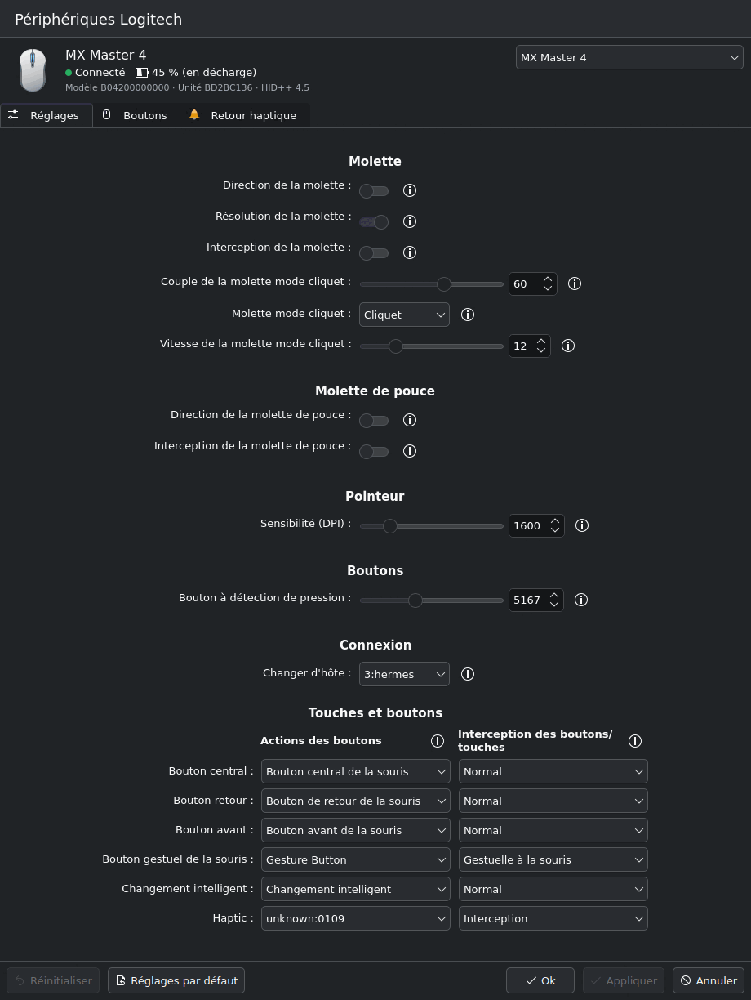
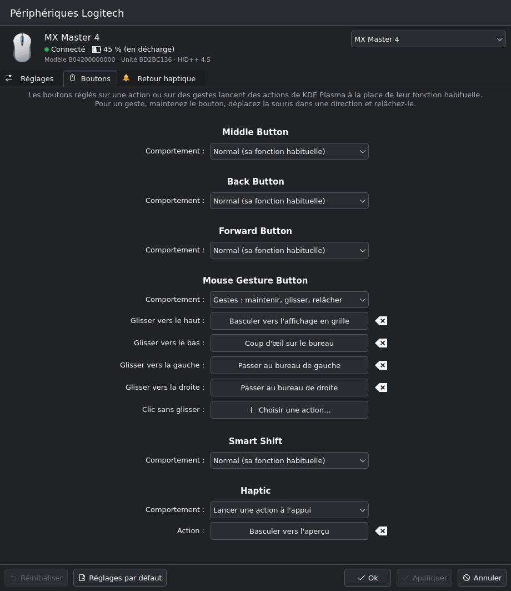

# plasmaar — Solaar for KDE Plasma

plasmaar is an effort to **port [Solaar](https://github.com/pwr-Solaar/Solaar) to KDE Plasma**.
It is not a fork going its own way: its base is, and stays, Solaar. Device support, the
HID++ protocol implementation, device settings and the rules engine all come from Solaar.
plasmaar replaces Solaar's GTK window with pieces that belong to Plasma: a background service,
a System Settings module, and integration with KWin and KDE's global shortcuts.

[](https://github.com/fredaime/plasmaar/actions/workflows/tests.yml)
[](https://github.com/fredaime/plasmaar/actions/workflows/kcm.yml)
[](LICENSE.txt)

<p align="center">

&#160;

</p>

## What plasmaar adds on top of Solaar

- **`plasmaard`**, a headless service that runs Solaar's device core as a systemd user service.
  It needs no GUI toolkit (so it survives KWin restarts), re-applies your settings when devices
  reconnect or the computer resumes, and exposes everything over a [D-Bus API](docs/dbus-api.md).
- **A System Settings module**: *Input Devices → Logitech Devices*. Device settings are drawn
  from Solaar's setting metadata, with Apply / Reset / Defaults, plus pages for button actions
  and haptic feedback. It is translated into French.
- **Buttons and gestures that run KDE actions** by name (Overview, Show Desktop, switch desktop,
  any kglobalaccel action), with no key bindings and no input injection. See [kde-actions.md](docs/kde-actions.md).
- **Haptic feedback on desktop events** for mice with haptics (MX Master 4): new notifications,
  virtual-desktop switches, low battery. See [desktop-events.md](docs/desktop-events.md).
- **Per-application rules on Plasma Wayland**, through a small KWin script that reports the
  focused window to Solaar's `Process` rule condition.
- **Plasma integration details**: notifications under plasmaar's own name, and device access
  for the logged-in user through a udev rule (no root).

## What comes from Solaar

Everything that knows about Logitech hardware: receivers (Unifying, Bolt, Lightspeed, Nano),
devices connected by USB or Bluetooth, HID++ 1.0 and 2.0, the settings, the rules engine and the
`solaar` command-line tool (`solaar show`, `solaar config`, `solaar pair`, …). Solaar's
documentation remains the reference for these: [capabilities](docs/capabilities.md),
[supported devices](docs/devices.md), [rules](docs/rules.md).

The Python packages keep Solaar's names (`solaar`, `logitech_receiver`). plasmaar keeps its own
configuration in `~/.config/plasmaar/` and its own application id, so it never shares settings
with a Solaar installation. Don't run Solaar's GTK application and `plasmaard` at the same time,
though: both would talk to the same devices.

## Status

Developed and tested on Kubuntu 26.04 / Plasma 6 with an MX Master 4, an MX Anywhere 3S and a
K850 keyboard, all over Bluetooth. Receivers are supported by Solaar's core but have not been
tested with plasmaar yet. The settings page shows advanced setting kinds (RGB lighting, equalizers, …)
read-only and has no pairing UI; use `solaar pair` for now. Progress and plans are in
[ROADMAP.md](docs/ROADMAP.md).

## Install from source

plasmaar needs KDE Plasma 6 (KDE Frameworks 6), Python ≥ 3.8 and, for the System Settings
module, a C++ toolchain. On Kubuntu:

```sh
sudo apt install python3-venv python3-gi python3-dbus gettext \
    cmake extra-cmake-modules qt6-base-dev qt6-declarative-dev \
    libkf6kcmutils-dev libkf6i18n-dev libkf6coreaddons-dev libkirigami-dev

git clone https://github.com/fredaime/plasmaar.git && cd plasmaar
python3 -m venv --system-site-packages .venv
.venv/bin/pip install -e .

make install_udev            # device access for the logged-in user (uses sudo)
make install_user_service PLASMAARD=$PWD/.venv/bin/plasmaard   # starts plasmaard with your session
make install_kcm             # the System Settings module; log out and back in to see it
make install_kwin_script     # optional: per-application rules
```

Each target has an `uninstall_…` counterpart. To try the settings module before logging out
again: `sh -c '. ~/.config/plasma-workspace/env/plasmaar-kcm.sh && exec kcmshell6 kcm_plasmaar'`.

## Documentation

| | |
|---|---|
| [ROADMAP.md](docs/ROADMAP.md) | What has been done, what is next, and why the code is split the way it is |
| [kcm.md](docs/kcm.md) | The System Settings module: build, install, architecture, screenshots |
| [kde-actions.md](docs/kde-actions.md) | Mapping buttons and gestures to KDE actions; custom rules |
| [desktop-events.md](docs/desktop-events.md) | Haptic feedback on desktop events; per-application rules |
| [dbus-api.md](docs/dbus-api.md) | The `io.github.fredaime.Plasmaar1` D-Bus API used by the front-ends |

## License and credits

GPL v2 or later, like Solaar (see [LICENSE.txt](LICENSE.txt)). In the sense of the GPL, plasmaar
is a modified version of Solaar: [NOTICE](NOTICE) records where it started from, how the files
it changed are marked, and the licenses of the third-party parts inherited from Solaar.

The device support at the heart of plasmaar is the work of Daniel Pavel and the
[Solaar contributors](https://github.com/pwr-Solaar/Solaar/graphs/contributors). plasmaar is
an independent project: it is not affiliated with the Solaar project or with Logitech.
