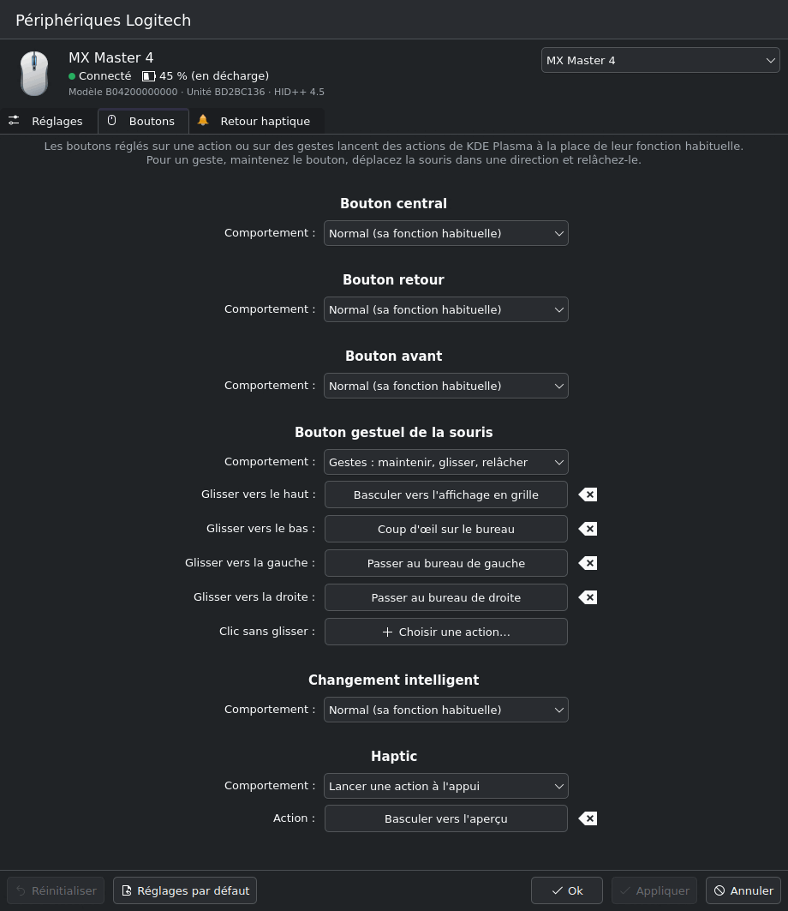
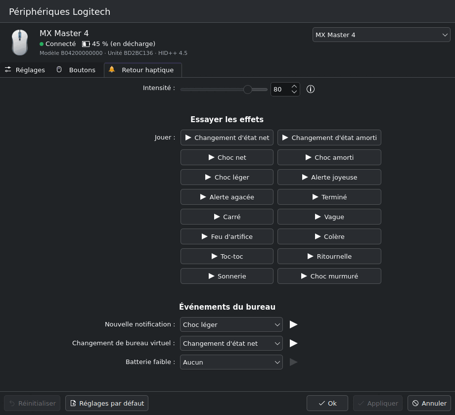

# The System Settings module (KCM)

"Logitech Devices" ("Périphériques Logitech") under System Settings → Input Devices: the settings page of
[Assessment B](ROADMAP.md#assessment-b-the-settings-page-system-settings-module). It is a thin C++ plugin
plus a QML page that talks to `plasmaard` over its [D-Bus API](dbus-api.md); all device work stays in the
service.

| Settings | Buttons | Haptic feedback |
|---|---|---|
|  |  |  |

More in [`kcm/screenshots/`](../kcm/screenshots): the KDE action picker (`mx-master-4-action-picker`),
the K850 (`k850-settings`), an offline device, write errors, an older plasmaard, plasmaard not running,
and the buttons of the real MX Master 4 read from the running service. They are rendered headless (see
the end of this page), in French.

## What it shows

- **Device header**: picker (switching is locked while there are unapplied changes), name, connection,
  battery, model/unit ids and HID++ version.
- **Settings**: every setting of the schema, grouped in sections (scroll wheel, thumb wheel, pointer, …).
  `TOGGLE` → switch, `CHOICE` → combo box (long numeric lists such as DPI → stepped slider + spin box,
  long named lists → searchable list), `RANGE` → slider + spin box, other kinds read-only, `display: false`
  hidden. Descriptions are behind the ⓘ buttons. Per-key settings (`reprogrammable-keys`, `divert-keys`,
  `persistent-remappable-keys`, …) form one table: a row per key, a column per setting.
- **Buttons** (Keys for a keyboard): each divertable button's behavior (normal, an action when pressed,
  gestures; only the modes it offers) and the KDE actions, chosen from a searchable list of
  `ListKdeActions` grouped by component, for the press or each gesture direction including a click.
- **Haptic feedback**: intensity (`haptic-level`), a test button per waveform (`PlayHaptic`, immediate),
  and which waveform desktop events play (`GetHapticEvents`/`SetHapticEvent`).
- **plasmaard not running**: a placeholder with a "Start plasmaard" button (systemd `StartUnit`) and the
  `systemctl --user start plasmaard` hint. The page comes back by itself when the service appears.

## Build, test, install

Build dependencies (Kubuntu/Debian names): `cmake extra-cmake-modules qt6-base-dev qt6-declarative-dev
libkf6kcmutils-dev libkf6i18n-dev libkf6coreaddons-dev libkirigami-dev gettext`; the tests also use
`qt6-declarative-dev-tools` (qmllint), `dbus-daemon` and `python3-gi`.

```sh
make test_kcm        # configure kcm/build, build, run the tests
make install_kcm     # install for your user, see below
make uninstall_kcm
```

`make install_kcm` installs into `~/.local` (`KCM_PREFIX=…` to change it): the plugin in
`~/.local/lib/<arch>/plugins/plasma/kcms/systemsettings/`, the French translation and a desktop entry.
Plasma only looks for plugins on `QT_PLUGIN_PATH`, so it also writes
`~/.config/plasma-workspace/env/plasmaar-kcm.sh`, which Plasma sources at login. Until you log in again:

```sh
sh -c '. ~/.config/plasma-workspace/env/plasmaar-kcm.sh && exec kcmshell6 kcm_plasmaar'
```

Without make: `cmake -S kcm -B kcm/build && cmake --build kcm/build && ctest --test-dir kcm/build`.
A plain `cmake --install` to `/usr` needs no environment script.

## Architecture

```
plasmaard ──D-Bus (JSON payloads)── PlasmaarClient ── Controller ── StagedModel ×3 ── QML pages
                                     (async calls,      (devices,      (settings,
                                      signals,          load/save/     buttons,
                                      service watch)    defaults)      haptic events)
                                                          │
                                         PlasmaarKcm (KQuickConfigModule): Apply/Reset/Defaults
```

C++ (`kcm/src/`):

- **`PlasmaarClient`**: every call is a `QDBusPendingCallWatcher` (never blocking the UI; 30 s timeout for
  sleeping Bluetooth devices) whose JSON reply is parsed into a `QVariant` and handed to a callback.
  It relays `DeviceAdded/Changed/Removed`, `SettingChanged` and `ButtonActionsChanged` with parsed
  payloads, and follows the service with a `QDBusServiceWatcher` (Checking → Running ↔ Missing).
- **`StagedModel`**: a list model of entries (settings, buttons or haptic events) with a live value and an
  optional staged value per row. QML reads `pending` (staged, else live) and stages edits, also per key of
  a map (`stageKey`) or along a path (`stagePath`, for gesture directions). Staging the live value again
  unstages the row, so "needs save" really means something would change. Live updates keep the user's
  edits: for maps, only the edited keys are kept and the others follow the device. A refresh with the same
  entries updates the rows in place (views keep their delegates). It also knows the `default` of each
  entry and the write error of each row.
- **`Controller`**: the devices, the selected one, its three models, the KDE actions and waveforms, and
  the KCM operations. `load()` drops edits and reloads; `save()` writes the changed rows one after the
  other (settings first, with `SetSetting`, or `SetSettingKey` per changed key; then `SetButtonAction`;
  then `SetHapticEvent`) and takes each reply as the new live value; a failed write keeps its edit staged
  and shows its error inline and in a summary. `defaults()` stages every setting's `default`. Each
  optional part has a state: Available, Unavailable (the device has none), NeedsNewerService (the method
  is unknown: an older plasmaard), Failed.
- **`PlasmaarKcm`**: the plugin. `needsSave` follows the staged edits; `representsDefaults` is true when
  the pending values are the defaults, or when no default is known, which disables the Defaults button.

The C++ types form a static QML module, `io.github.fredaime.plasmaar`, so the QML is typed and qmllint
checks it against the generated `.qmltypes`.

QML (`kcm/ui/`, loaded by `kcmutils_add_qml_kcm`): `main.qml` (header with the device and tabs, service
placeholders, the shared pickers), `DeviceHeader`, `SettingsPage` (sections of `SettingRow`) and
`KeyMapTable`/`KeyCell`, `ButtonsPage`/`ActionField`, `HapticsPage`, `PickerDialog` (a
`Kirigami.SearchDialog`), `SnapshotRunner`. The pages are rebuilt when another device is selected rather
than having all their rows replaced under the form layouts.

### With an older plasmaard

Each addition is optional: an `org.freedesktop.DBus.Error.UnknownMethod` answer hides or explains the part
that needs it. Without `GetButtonActions` the Buttons tab says that a newer plasmaard is needed (if the
device has divertable buttons); without `GetHapticEvents` the haptics page keeps intensity and the test
buttons (waveforms from the `haptic-play` setting); without `"default"` the Defaults button stays off.

## Translations

All strings go through `i18n()`; the domain is `kcm_plasmaar`. `kcm/Messages.sh` extracts them into
`kcm/po/kcm_plasmaar.pot` and merges them into the translations; `kcm/po/fr/kcm_plasmaar.po` is the French
one, installed by `ki18n_install`. Setting labels and descriptions come translated from the service.

## Tests and checks

`ctest` in the build directory runs:

- `stagedmodeltest`: the staging rules (unstaging, per-key edits and live merges, nested paths, defaults,
  in-place refresh, errors) and the JSON conversions.
- `controllertest`: the `Controller` against `tools/mock_plasmaard.py` on a private bus
  (`dbus-run-session` with `kcm/autotests/isolated-bus.conf`, which has no service activation): loading,
  apply, per-key apply, live updates, defaults, write errors, button actions, haptic events, the service
  quitting and coming back, and an older service. It refuses to run if a plasmaard already owns the name.
- `qmllint`: `kcm/autotests/qmllint.py` fails on any warning except unqualified access to `kcm` and the
  i18n functions, which KCMUtils and KI18n inject as context properties that qmllint cannot see.

`.github/workflows/kcm.yml` builds with warnings as errors and runs these tests in Ubuntu 26.04 and Fedora
containers.

## The mock service and headless snapshots

`tools/mock_plasmaard.py` implements the whole API with data captured from a real MX Master 4, K850 and
MX Anywhere 3S (`tools/mock_plasmaard_data.json`), in memory, with the same signals. Run it only on a
private bus; it refuses to start next to a running plasmaard. `--legacy` emulates a v1-only service,
`--fail NAME` makes writes of a setting fail (`button:<control>`, `haptic:<event>` too), `--delay MS`
slows every answer, `-v` logs calls. Its `io.github.fredaime.PlasmaarMock` interface simulates the
device: `SetDeviceValue`, `SetOnline`, `SetBattery`, and `Quit`.

```sh
dbus-run-session --config-file=kcm/autotests/isolated-bus.conf -- \
    sh -c 'python3 tools/mock_plasmaard.py -v & sleep 1; \
           QT_PLUGIN_PATH=$PWD/kcm/build/bin kcmshell6 kcm_plasmaar'
```

With `PLASMAAR_KCM_SNAPSHOT=/path/prefix` the module renders each page of each device once the data has
loaded, grows the window to fit, saves `/path/prefix-<device>-<page>.png` and quits. `kcm/run-snapshots.sh`
does it all offscreen (`QT_QPA_PLATFORM=offscreen`, French by default):

```sh
kcm/run-snapshots.sh /tmp/shots/mock                      # against the mock, private bus
kcm/run-snapshots.sh --legacy /tmp/shots/legacy           # an older plasmaard
kcm/run-snapshots.sh --fail smart-shift --scenario apply-errors /tmp/shots/errors
kcm/run-snapshots.sh --no-service /tmp/shots/none         # plasmaard not running
kcm/run-snapshots.sh --real /tmp/shots/real               # your plasmaard, read-only
```

Snapshot mode never writes to the service; the `apply-errors` scenario, which stages and applies a few
edits, is refused with `--real`.

## Not covered yet

- B8: the advanced kinds (`MULTIPLE_TOGGLE`, `MULTIPLE_RANGE`, `PACKED_RANGE`, …) are shown read-only.
- B9: pairing with Bolt/Unifying receivers.
- Edits are per device: switching devices requires applying or resetting first.
